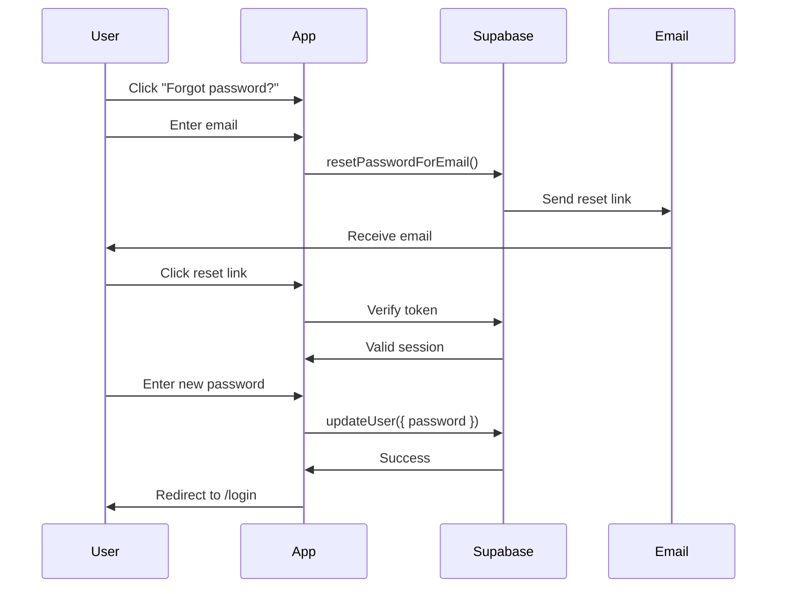

# 🔒 Password Reset System - Setup Guide

## ✅ Sistema Implementado

Se ha agregado un sistema completo de recuperación de contraseña con 3 páginas:

1. **`/forgot-password`** - Solicitar link de recuperación
2. **`/reset-password`** - Crear nueva contraseña
3. **`/login`** - Ahora incluye link "Forgot password?"

---

## 🎯 Flujo de Usuario

### 1. Usuario Olvida Contraseña
1. Click en **"Forgot password?"** en la página de login
2. Ingresa su email
3. Click en **"Send Recovery Link"**

### 2. Email de Recuperación
1. Usuario recibe email de Supabase
2. Click en el link del email
3. Redirige a `/reset-password`

### 3. Nueva Contraseña
1. Ingresa nueva contraseña
2. Confirma la contraseña
3. Click en **"Reset Password"**
4. Redirección automática a `/login`

---

## ⚙️ CONFIGURACIÓN REQUERIDA EN SUPABASE

### Paso 1: Configurar Redirect URL

1. Ve a tu proyecto en **Supabase Dashboard**
2. Click en **Authentication** → **URL Configuration**
3. En **Redirect URLs**, agrega:
   ```
   https://tu-dominio.vercel.app/reset-password
   http://localhost:3000/reset-password
   ```
4. Click en **Save**

### Paso 2: Configurar Email Templates (Opcional)

1. Ve a **Authentication** → **Email Templates**
2. Encuentra **"Reset Password"**
3. Personaliza el email si lo deseas
4. Variables disponibles:
   - `{{ .ConfirmationURL }}` - Link de reset

**Template de ejemplo:**
```html
<h2>Reset Your Password</h2>
<p>Click the button below to reset your password:</p>
<p><a href="{{ .ConfirmationURL }}">Reset Password</a></p>
<p>This link will expire in 1 hour.</p>
<p>If you didn't request this, please ignore this email.</p>
```

### Paso 3: Verificar SMTP Settings

Para que los emails funcionen en producción:

1. Ve a **Settings** → **Authentication**
2. Verifica que **Enable Email Confirmations** esté activado
3. En producción, configura tu propio SMTP (opcional):
   - Mailgun
   - SendGrid
   - AWS SES
   - Resend

---

## 🧪 TESTING LOCAL

### 1. Testing con Supabase Inbucket (Development)

Supabase incluye un inbox de prueba:

1. Ve a **Authentication** → **Email**
2. Click en **"Inbucket"** (arriba a la derecha)
3. Verás todos los emails enviados en desarrollo

### 2. Probar el Flujo Completo

```bash
# 1. Iniciar servidor local
npm run dev

# 2. Ve a http://localhost:3000/login
# 3. Click en "Forgot password?"
# 4. Ingresa un email de prueba
# 5. Ve al Inbucket de Supabase
# 6. Copia el link de reset
# 7. Pega en el navegador
# 8. Ingresa nueva contraseña
```

---

## 🎨 UI/UX Features

### Página Forgot Password
- ✅ Validación de email
- ✅ Mensaje de éxito con confirmación visual
- ✅ Loading state durante el envío
- ✅ Error handling
- ✅ Link para volver a login

### Página Reset Password
- ✅ Validación de link (token válido)
- ✅ Verificación de contraseña (min 6 caracteres)
- ✅ Confirmación de contraseña (match)
- ✅ Indicador visual de fortaleza
- ✅ Redirección automática después de éxito
- ✅ Mensaje si link expiró

### Login Page
- ✅ Link "Forgot password?" visible
- ✅ Posicionado al lado del label "Password"
- ✅ Estilo consistente con el tema

---

## 🔐 Seguridad

### Implementaciones de Seguridad

1. **Token Expiration**: Links expiran en 1 hora
2. **Single Use**: El token solo funciona una vez
3. **Session Validation**: Verifica sesión válida antes de permitir reset
4. **Password Requirements**: Mínimo 6 caracteres
5. **Confirmation Match**: Debe confirmar contraseña
6. **Rate Limiting**: Supabase limita requests automáticamente

### Prevención de Ataques

- ✅ No revela si el email existe o no
- ✅ Tokens únicos e irrepetibles
- ✅ HTTPS obligatorio en producción
- ✅ Rate limiting en API de Supabase
- ✅ Logout automático después de cambio

---

## 🌐 VARIABLES DE ENTORNO

No requiere variables adicionales. Usa las existentes:

```bash
NEXT_PUBLIC_SUPABASE_URL=https://tu-proyecto.supabase.co
NEXT_PUBLIC_SUPABASE_ANON_KEY=tu-anon-key
```

---

## 📱 Responsive Design

Todas las páginas son completamente responsive:
- ✅ Mobile optimizado
- ✅ Tablet optimizado
- ✅ Desktop optimizado
- ✅ Mismo tema synthwave/cyberpunk
- ✅ Animaciones suaves

---

## 🚀 DEPLOYMENT

### Vercel

El sistema funciona automáticamente en Vercel:

1. Push el código a GitHub
2. Vercel detecta los cambios
3. Deploy automático
4. **IMPORTANTE**: Agrega las Redirect URLs en Supabase con tu dominio de Vercel

### Producción Checklist

- [ ] Redirect URLs configuradas en Supabase
- [ ] SMTP configurado (opcional pero recomendado)
- [ ] Email templates personalizados (opcional)
- [ ] Testing en staging environment
- [ ] Verificar que emails llegan
- [ ] Probar link de reset en producción

---

## 📊 Monitoring

Para monitorear el uso:

1. **Supabase Dashboard** → **Authentication** → **Users**
   - Ver usuarios que solicitaron reset
   
2. **Vercel Logs**
   - Ver requests a `/forgot-password` y `/reset-password`

3. **Email Delivery**
   - Si usas SMTP externo, verifica delivery rates

---

## 🐛 TROUBLESHOOTING

### Email no llega

**Solución:**
1. Verifica SMTP settings en Supabase
2. Chequea spam/junk folder
3. Ve al Inbucket en development
4. Confirma que el email está en la lista de usuarios de Supabase

### Link expiró

**Solución:**
1. Los links expiran en 1 hora por seguridad
2. Usuario debe solicitar un nuevo link
3. Mensaje claro en la UI explicando esto

### Error "Invalid token"

**Solución:**
1. Link ya fue usado (single-use)
2. Link expiró (1 hora)
3. Link corrupto (copia/pega mal)
4. Usuario debe solicitar nuevo link

### Redirect no funciona

**Solución:**
1. Verifica que la URL esté en **Redirect URLs** de Supabase
2. Debe ser EXACTA (incluye http/https y puerto)
3. Para local: `http://localhost:3000/reset-password`
4. Para prod: `https://tu-dominio.vercel.app/reset-password`

---

## 🔄 Flujo Técnico Completo



---

## ✅ Archivos Creados

```
src/app/(auth)/
├── forgot-password/
│   └── page.tsx          # Solicitar link de recuperación
├── reset-password/
│   └── page.tsx          # Crear nueva contraseña
└── login/
    └── page.tsx          # Actualizado con link "Forgot password?"
```

---

## 🎉 Sistema Listo para Producción

El sistema de recuperación de contraseña está completamente implementado y listo para usar. Solo necesitas:

1. ✅ Configurar Redirect URLs en Supabase
2. ✅ (Opcional) Personalizar email templates
3. ✅ (Opcional) Configurar SMTP propio para producción
4. ✅ Deploy a Vercel

**¡Todo listo!** 🚀
